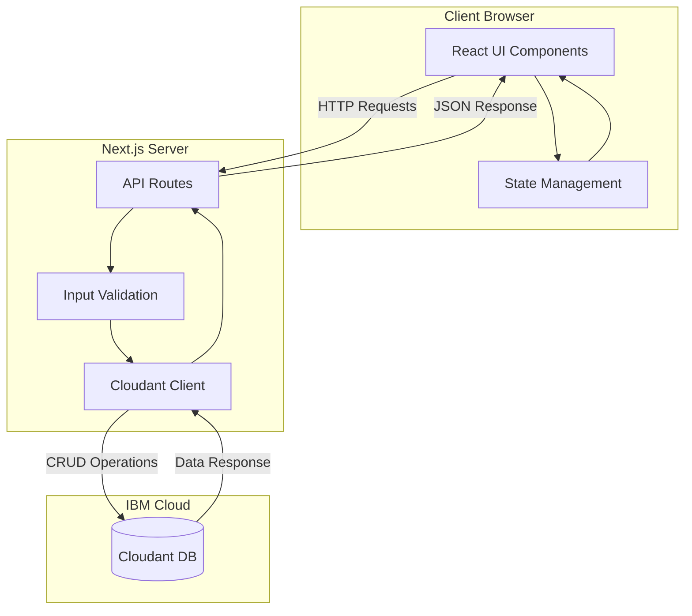
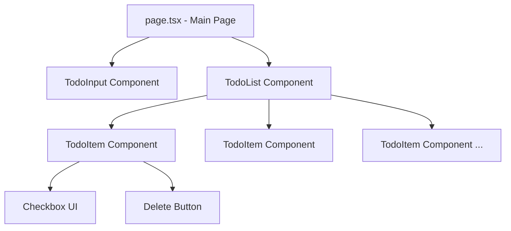
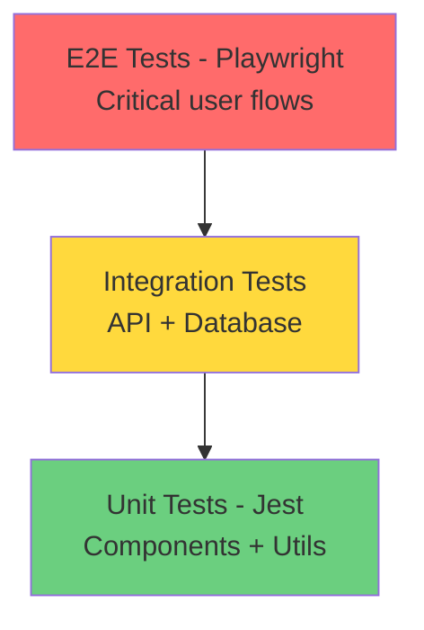

# TODO App - Implementation Plan (Improved)

## Document Overview
This document provides a detailed, step-by-step implementation plan for building the TODO-APP based on the requirements specified in [`AI-TASKS/requirements/todo-app-req-improved.md`](./requirements/todo-app-req-improved.md).

## Table of Contents
1. [Technology Stack](#1-technology-stack)
2. [Project Architecture](#2-project-architecture)
3. [Data Models](#3-data-models)
4. [API Specification](#4-api-specification)
5. [Implementation Phases](#5-implementation-phases)
6. [Testing Strategy](#6-testing-strategy)
7. [Deployment & Environment](#7-deployment--environment)
8. [Development Workflow](#8-development-workflow)

---

## 1. Technology Stack

### Frontend
- **Framework**: Next.js 14+ (App Router)
- **UI Library**: React 18+
- **Language**: TypeScript 5+
- **Styling**: Tailwind CSS or CSS Modules
- **State Management**: React Context API or Zustand
- **Form Handling**: React Hook Form
- **Date Handling**: date-fns or Day.js

### Backend
- **Runtime**: Node.js 18+ LTS
- **Framework**: Next.js API Routes (App Router)
- **Language**: TypeScript 5+
- **Database**: IBM Cloudant DB
- **SDK**: [@ibm-cloud/cloudant](https://github.com/IBM/cloudant-node-sdk)
- **Validation**: Zod or Yup

### Testing
- **E2E Testing**: Playwright
- **Unit Testing**: Jest + React Testing Library
- **API Testing**: Supertest or Playwright API testing

### Development Tools
- **Package Manager**: npm or pnpm
- **Linting**: ESLint
- **Formatting**: Prettier
- **Type Checking**: TypeScript compiler

---

## 2. Project Architecture

### 2.1 Folder Structure
```
todo-bob/
├── src/
│   ├── app/                      # Next.js App Router
│   │   ├── api/                  # API routes
│   │   │   └── todos/
│   │   │       ├── route.ts      # GET, POST /api/todos
│   │   │       └── [id]/
│   │   │           └── route.ts  # GET, PUT, DELETE /api/todos/:id
│   │   ├── layout.tsx            # Root layout
│   │   ├── page.tsx              # Home page (main TODO UI)
│   │   └── globals.css           # Global styles
│   ├── components/               # React components
│   │   ├── TodoList.tsx          # Task list container
│   │   ├── TodoItem.tsx          # Individual task item
│   │   ├── TodoInput.tsx         # Task input form
│   │   └── ui/                   # Reusable UI components
│   │       ├── Button.tsx
│   │       ├── Checkbox.tsx
│   │       └── Input.tsx
│   ├── lib/                      # Utility functions
│   │   ├── cloudant.ts           # Cloudant DB client
│   │   ├── validation.ts         # Input validation schemas
│   │   └── utils.ts              # Helper functions
│   ├── types/                    # TypeScript type definitions
│   │   └── todo.ts               # Todo type definitions
│   └── hooks/                    # Custom React hooks
│       └── useTodos.ts           # Todo data fetching hook
├── tests/                        # Test files
│   ├── e2e/                      # Playwright E2E tests
│   │   ├── todo-crud.spec.ts
│   │   └── todo-validation.spec.ts
│   └── unit/                     # Jest unit tests
│       ├── components/
│       └── lib/
├── public/                       # Static assets
├── .env.local                    # Environment variables
├── next.config.js                # Next.js configuration
├── tsconfig.json                 # TypeScript configuration
├── playwright.config.ts          # Playwright configuration
└── package.json                  # Dependencies
```

### 2.2 Architecture Diagram



### 2.3 Component Hierarchy



---

## 3. Data Models

### 3.1 TypeScript Interfaces

```typescript
// src/types/todo.ts

export interface Todo {
  _id: string;                    // Cloudant document ID
  _rev?: string;                  // Cloudant revision (for updates)
  id: number;                     // Application-level unique ID
  description: string;            // Task description (1-500 chars)
  state: TodoState;               // Task status
  createdAt: string;              // ISO 8601 timestamp
  dueDate?: string;               // Optional ISO 8601 date
}

export enum TodoState {
  OPEN = 'open',
  FINISHED = 'finished'
}

export interface CreateTodoRequest {
  description: string;
  dueDate?: string;
}

export interface UpdateTodoRequest {
  description?: string;
  state?: TodoState;
  dueDate?: string;
}

export interface TodoResponse {
  success: boolean;
  data?: Todo | Todo[];
  error?: string;
}
```

### 3.2 Validation Schemas

```typescript
// src/lib/validation.ts

import { z } from 'zod';

export const createTodoSchema = z.object({
  description: z.string()
    .trim()
    .min(1, 'Description is required')
    .max(500, 'Description must be 500 characters or less'),
  dueDate: z.string().datetime().optional()
});

export const updateTodoSchema = z.object({
  description: z.string()
    .trim()
    .min(1)
    .max(500)
    .optional(),
  state: z.enum(['open', 'finished']).optional(),
  dueDate: z.string().datetime().optional()
});
```

### 3.3 Cloudant Document Structure

```json
{
  "_id": "todo_1713437989421",
  "_rev": "1-abc123...",
  "id": 1,
  "description": "Complete project documentation",
  "state": "open",
  "createdAt": "2024-04-18T10:19:49.421Z",
  "dueDate": "2024-04-25T23:59:59.999Z"
}
```

---

## 4. API Specification

### 4.1 Endpoints

#### GET `/api/todos`
**Description**: Retrieve all todo tasks

**Response**: `200 OK`
```json
{
  "success": true,
  "data": [
    {
      "_id": "todo_1713437989421",
      "id": 1,
      "description": "Complete project documentation",
      "state": "open",
      "createdAt": "2024-04-18T10:19:49.421Z",
      "dueDate": "2024-04-25T23:59:59.999Z"
    }
  ]
}
```

#### POST `/api/todos`
**Description**: Create a new todo task

**Request Body**:
```json
{
  "description": "New task description",
  "dueDate": "2024-04-25T23:59:59.999Z"
}
```

**Response**: `201 Created`
```json
{
  "success": true,
  "data": {
    "_id": "todo_1713437989421",
    "id": 1,
    "description": "New task description",
    "state": "open",
    "createdAt": "2024-04-18T10:19:49.421Z",
    "dueDate": "2024-04-25T23:59:59.999Z"
  }
}
```

**Error Response**: `400 Bad Request`
```json
{
  "success": false,
  "error": "Description is required"
}
```

#### PUT `/api/todos/[id]`
**Description**: Update an existing todo task

**Request Body**:
```json
{
  "state": "finished"
}
```

**Response**: `200 OK`
```json
{
  "success": true,
  "data": {
    "_id": "todo_1713437989421",
    "id": 1,
    "description": "New task description",
    "state": "finished",
    "createdAt": "2024-04-18T10:19:49.421Z"
  }
}
```

#### DELETE `/api/todos/[id]`
**Description**: Delete a todo task

**Response**: `200 OK`
```json
{
  "success": true,
  "data": {
    "id": 1,
    "deleted": true
  }
}
```

### 4.2 Error Handling

All API endpoints follow consistent error response format:

```json
{
  "success": false,
  "error": "Error message description"
}
```

**HTTP Status Codes**:
- `200 OK` - Successful GET, PUT, DELETE
- `201 Created` - Successful POST
- `400 Bad Request` - Validation error
- `404 Not Found` - Resource not found
- `500 Internal Server Error` - Server error

---

## 5. Implementation Phases

### Phase 1: Project Setup & Configuration
**Estimated Time**: 2-3 hours

#### Step 1.1: Initialize Next.js Project
```bash
npx create-next-app@latest todo-bob --typescript --tailwind --app --no-src-dir
cd todo-bob
```

#### Step 1.2: Install Dependencies
```bash
npm install @ibm-cloud/cloudant zod date-fns
npm install -D @playwright/test @types/node
```

#### Step 1.3: Configure Environment Variables
- Copy `.env.local` with Cloudant credentials
- Add `.env.local` to `.gitignore`
- Verify connection details:
  - `CLOUDANT_URL`
  - `CLOUDANT_APIKEY`
  - `CLOUDANT_DB_NAME`

#### Step 1.4: Setup TypeScript Configuration
- Configure `tsconfig.json` with strict mode
- Add path aliases for imports

#### Step 1.5: Initialize Cloudant Database
- Create Cloudant client in [`src/lib/cloudant.ts`](src/lib/cloudant.ts)
- Test connection to Cloudant DB
- Create database if it doesn't exist
- Create indexes for efficient queries

**Acceptance Criteria**:
- ✅ Next.js project runs with `npm run dev`
- ✅ TypeScript compiles without errors
- ✅ Cloudant connection established successfully
- ✅ Environment variables loaded correctly

---

### Phase 2: Backend API Implementation
**Estimated Time**: 4-5 hours

#### Step 2.1: Create Data Models
- Define TypeScript interfaces in [`src/types/todo.ts`](src/types/todo.ts)
- Create validation schemas in [`src/lib/validation.ts`](src/lib/validation.ts)

#### Step 2.2: Implement Cloudant Client
File: [`src/lib/cloudant.ts`](src/lib/cloudant.ts)

**Functions to implement**:
- `getCloudantClient()` - Initialize and return Cloudant client
- `getAllTodos()` - Fetch all todos from database
- `getTodoById(id)` - Fetch single todo by ID
- `createTodo(data)` - Insert new todo document
- `updateTodo(id, data)` - Update existing todo
- `deleteTodo(id)` - Delete todo document

#### Step 2.3: Implement API Routes

**File**: [`src/app/api/todos/route.ts`](src/app/api/todos/route.ts)
- `GET` handler - List all todos
- `POST` handler - Create new todo

**File**: [`src/app/api/todos/[id]/route.ts`](src/app/api/todos/[id]/route.ts)
- `GET` handler - Get single todo
- `PUT` handler - Update todo
- `DELETE` handler - Delete todo

#### Step 2.4: Add Error Handling
- Implement try-catch blocks in all API routes
- Add input validation using Zod schemas
- Return consistent error responses
- Log errors for debugging

#### Step 2.5: Test API Endpoints
- Use Postman or curl to test each endpoint
- Verify CRUD operations work correctly
- Test validation rules
- Test error scenarios

**Acceptance Criteria**:
- ✅ All API endpoints respond correctly
- ✅ Data persists in Cloudant DB
- ✅ Validation prevents invalid data
- ✅ Error responses are consistent
- ✅ API handles edge cases gracefully

---

### Phase 3: Frontend UI Implementation
**Estimated Time**: 6-8 hours

#### Step 3.1: Create UI Components

**File**: [`src/components/ui/Input.tsx`](src/components/ui/Input.tsx)
- Reusable text input component
- Support for placeholder, value, onChange
- Keyboard event handling (Enter key)

**File**: [`src/components/ui/Button.tsx`](src/components/ui/Button.tsx)
- Reusable button component
- Support for variants (primary, danger)
- Loading state support

**File**: [`src/components/ui/Checkbox.tsx`](src/components/ui/Checkbox.tsx)
- Custom checkbox component
- Visual states for checked/unchecked
- Accessible with proper ARIA labels

#### Step 3.2: Create Todo Components

**File**: [`src/components/TodoInput.tsx`](src/components/TodoInput.tsx)
- Input field for task description
- Add button
- Form submission handling
- Input validation and error display
- Clear input after submission

**File**: [`src/components/TodoItem.tsx`](src/components/TodoItem.tsx)
- Display task description
- Checkbox for state toggle
- Delete button with trash icon
- Due date display (if set)
- Visual distinction for completed tasks

**File**: [`src/components/TodoList.tsx`](src/components/TodoList.tsx)
- Container for all todo items
- Empty state message
- Loading state
- Error state

#### Step 3.3: Implement Data Fetching Hook

**File**: [`src/hooks/useTodos.ts`](src/hooks/useTodos.ts)

**Functions**:
- `useTodos()` - Fetch and manage todos
- `createTodo(description, dueDate?)` - Create new todo
- `toggleTodo(id)` - Toggle todo state
- `deleteTodo(id)` - Delete todo
- Handle loading and error states
- Optimistic UI updates

#### Step 3.4: Build Main Page

**File**: [`src/app/page.tsx`](src/app/page.tsx)
- Import and compose all components
- Implement layout structure:
  1. Title bar
  2. TodoInput component
  3. TodoList component
- Connect components to data hook
- Handle user interactions

#### Step 3.5: Add Styling

**Approach**: Tailwind CSS or CSS Modules
- Implement responsive design
- Match design from [`todo-app-design.png`](./requirements/todo-app-design.png)
- Add hover states and transitions
- Ensure mobile-friendly layout
- Add visual feedback for interactions

**Acceptance Criteria**:
- ✅ UI matches design specification
- ✅ All components render correctly
- ✅ User can create, toggle, and delete todos
- ✅ Input validation works on frontend
- ✅ UI is responsive on all screen sizes
- ✅ Loading and error states display properly

---

### Phase 4: Integration & State Management
**Estimated Time**: 3-4 hours

#### Step 4.1: Connect Frontend to Backend
- Implement API calls in [`useTodos`](src/hooks/useTodos.ts) hook
- Handle async operations
- Update UI based on API responses

#### Step 4.2: Implement Optimistic Updates
- Update UI immediately on user action
- Revert changes if API call fails
- Show loading indicators during operations

#### Step 4.3: Add Error Handling
- Display user-friendly error messages
- Handle network errors gracefully
- Implement retry logic for failed requests

#### Step 4.4: Implement Data Synchronization
- Ensure UI reflects database state
- Handle concurrent updates
- Refresh data after mutations

**Acceptance Criteria**:
- ✅ Frontend communicates with backend successfully
- ✅ UI updates reflect database changes
- ✅ Errors are handled and displayed to user
- ✅ Optimistic updates work correctly

---

### Phase 5: Testing Implementation
**Estimated Time**: 4-6 hours

#### Step 5.1: Setup Playwright

**File**: [`playwright.config.ts`](playwright.config.ts)
```typescript
import { defineConfig } from '@playwright/test';

export default defineConfig({
  testDir: './tests/e2e',
  use: {
    baseURL: 'http://localhost:3000',
  },
  webServer: {
    command: 'npm run dev',
    port: 3000,
    reuseExistingServer: !process.env.CI,
  },
});
```

#### Step 5.2: Write E2E Tests

**File**: [`tests/e2e/todo-crud.spec.ts`](tests/e2e/todo-crud.spec.ts)

**Test Scenarios**:
1. **Create Todo**
   - Enter task description
   - Click Add button
   - Verify task appears in list
   - Verify input field is cleared

2. **Toggle Todo State**
   - Click checkbox on open task
   - Verify task marked as finished
   - Click checkbox on finished task
   - Verify task marked as open

3. **Delete Todo**
   - Click delete button
   - Verify task removed from list
   - Verify task deleted from database

4. **Keyboard Support**
   - Enter task description
   - Press Enter key
   - Verify task created

**File**: [`tests/e2e/todo-validation.spec.ts`](tests/e2e/todo-validation.spec.ts)

**Test Scenarios**:
1. **Empty Description**
   - Try to create task with empty description
   - Verify error message displayed
   - Verify task not created

2. **Maximum Length**
   - Enter description > 500 characters
   - Verify error message displayed
   - Verify task not created

3. **Whitespace Only**
   - Enter only spaces
   - Verify error message displayed
   - Verify task not created

#### Step 5.3: Write Unit Tests

**File**: [`tests/unit/lib/validation.test.ts`](tests/unit/lib/validation.test.ts)
- Test validation schemas
- Test edge cases
- Test error messages

**File**: [`tests/unit/components/TodoItem.test.tsx`](tests/unit/components/TodoItem.test.tsx)
- Test component rendering
- Test user interactions
- Test prop handling

#### Step 5.4: Run Tests
```bash
# Run E2E tests
npm run test:e2e

# Run unit tests
npm run test:unit

# Run all tests
npm test
```

**Acceptance Criteria**:
- ✅ All E2E tests pass
- ✅ All unit tests pass
- ✅ Test coverage > 80%
- ✅ Tests run in CI/CD pipeline

---

### Phase 6: Responsive Design & Polish
**Estimated Time**: 2-3 hours

#### Step 6.1: Test Responsive Design
- Test on mobile devices (320px - 480px)
- Test on tablets (768px - 1024px)
- Test on desktop (1280px+)
- Verify touch interactions work on mobile

#### Step 6.2: Add Animations
- Smooth transitions for state changes
- Fade in/out for task creation/deletion
- Loading spinners
- Hover effects

#### Step 6.3: Accessibility Improvements
- Add ARIA labels
- Ensure keyboard navigation works
- Test with screen readers
- Verify color contrast ratios

#### Step 6.4: Performance Optimization
- Optimize re-renders
- Lazy load components if needed
- Minimize bundle size
- Add loading states

**Acceptance Criteria**:
- ✅ App works on all device sizes
- ✅ Animations are smooth
- ✅ App is accessible
- ✅ Performance is acceptable

---

### Phase 7: Documentation & Deployment
**Estimated Time**: 2-3 hours

#### Step 7.1: Write Documentation

**File**: [`README.md`](README.md)
- Project overview
- Setup instructions
- Environment variables
- Running the app
- Running tests
- Deployment guide

#### Step 7.2: Code Cleanup
- Remove console.logs
- Remove unused imports
- Format code with Prettier
- Run ESLint and fix issues

#### Step 7.3: Build for Production
```bash
npm run build
```
- Verify build succeeds
- Test production build locally
- Check bundle size

#### Step 7.4: Deployment Preparation
- Choose deployment platform (Vercel, Netlify, etc.)
- Configure environment variables
- Setup CI/CD pipeline
- Deploy to production

**Acceptance Criteria**:
- ✅ Documentation is complete
- ✅ Code is clean and formatted
- ✅ Production build works
- ✅ App is deployed successfully

---

## 6. Testing Strategy

### 6.1 Test Pyramid



### 6.2 Test Coverage Goals
- **Unit Tests**: 80%+ coverage
- **Integration Tests**: All API endpoints
- **E2E Tests**: All critical user flows

### 6.3 Test Scenarios

#### Critical Paths (E2E)
1. Create todo → Verify in list → Verify in DB
2. Toggle todo state → Verify UI update → Verify in DB
3. Delete todo → Verify removed from list → Verify removed from DB
4. Validation errors → Verify error messages → Verify no DB changes

#### Edge Cases
- Empty database state
- Network failures
- Concurrent updates
- Invalid data formats
- Database connection errors

### 6.4 Testing Commands
```bash
# Run all tests
npm test

# Run E2E tests
npm run test:e2e

# Run E2E tests in UI mode
npm run test:e2e:ui

# Run unit tests
npm run test:unit

# Run tests with coverage
npm run test:coverage
```

---

## 7. Deployment & Environment

### 7.1 Environment Variables

**Required Variables**:
```env
# Cloudant Database Configuration
CLOUDANT_URL=https://your-instance.cloudantnosqldb.appdomain.cloud
CLOUDANT_APIKEY=your-api-key
CLOUDANT_DB_NAME=todo-db

# Application Configuration
NODE_ENV=production
NEXT_PUBLIC_API_URL=https://your-domain.com
```

### 7.2 Deployment Platforms

#### Option 1: Vercel (Recommended)
```bash
# Install Vercel CLI
npm i -g vercel

# Deploy
vercel --prod
```

**Configuration**:
- Add environment variables in Vercel dashboard
- Enable automatic deployments from Git
- Configure custom domain

#### Option 2: Docker
```dockerfile
FROM node:18-alpine
WORKDIR /app
COPY package*.json ./
RUN npm ci --only=production
COPY . .
RUN npm run build
EXPOSE 3000
CMD ["npm", "start"]
```

### 7.3 CI/CD Pipeline

**GitHub Actions Example**:
```yaml
name: CI/CD
on: [push, pull_request]
jobs:
  test:
    runs-on: ubuntu-latest
    steps:
      - uses: actions/checkout@v3
      - uses: actions/setup-node@v3
      - run: npm ci
      - run: npm run lint
      - run: npm run test:unit
      - run: npm run build
```

---

## 8. Development Workflow

### 8.1 Getting Started

```bash
# Clone repository
git clone <repository-url>
cd todo-bob

# Install dependencies
npm install

# Setup environment
cp .env.example .env.local
# Edit .env.local with your Cloudant credentials

# Run development server
npm run dev

# Open browser
open http://localhost:3000
```

### 8.2 Development Commands

```bash
# Start development server
npm run dev

# Build for production
npm run build

# Start production server
npm start

# Run linter
npm run lint

# Format code
npm run format

# Run type checking
npm run type-check

# Run all tests
npm test
```

### 8.3 Git Workflow

1. Create feature branch: `git checkout -b feature/task-description`
2. Make changes and commit: `git commit -m "feat: add task creation"`
3. Push to remote: `git push origin feature/task-description`
4. Create pull request
5. Run tests in CI/CD
6. Merge after review

### 8.4 Code Quality Checks

**Pre-commit Hooks** (using Husky):
- Run ESLint
- Run Prettier
- Run type checking
- Run unit tests

---

## 9. Implementation Checklist

### Phase 1: Setup ✅
- [ ] Initialize Next.js project
- [ ] Install dependencies
- [ ] Configure environment variables
- [ ] Setup Cloudant connection
- [ ] Configure TypeScript

### Phase 2: Backend ✅
- [ ] Create data models
- [ ] Implement Cloudant client
- [ ] Create API routes (GET, POST, PUT, DELETE)
- [ ] Add validation
- [ ] Test API endpoints

### Phase 3: Frontend ✅
- [ ] Create UI components
- [ ] Create Todo components
- [ ] Implement data fetching hook
- [ ] Build main page
- [ ] Add styling

### Phase 4: Integration ✅
- [ ] Connect frontend to backend
- [ ] Implement optimistic updates
- [ ] Add error handling
- [ ] Test data synchronization

### Phase 5: Testing ✅
- [ ] Setup Playwright
- [ ] Write E2E tests
- [ ] Write unit tests
- [ ] Achieve test coverage goals

### Phase 6: Polish ✅
- [ ] Test responsive design
- [ ] Add animations
- [ ] Improve accessibility
- [ ] Optimize performance

### Phase 7: Deployment ✅
- [ ] Write documentation
- [ ] Clean up code
- [ ] Build for production
- [ ] Deploy to production

---

## 10. Success Criteria

The implementation is considered complete when:

1. ✅ All functional requirements from [`todo-app-req-improved.md`](./requirements/todo-app-req-improved.md) are met
2. ✅ All API endpoints work correctly
3. ✅ UI matches the design specification
4. ✅ All tests pass (E2E and unit)
5. ✅ App is responsive on all devices
6. ✅ Data persists in Cloudant DB
7. ✅ Error handling works correctly
8. ✅ Code is clean and well-documented
9. ✅ App is deployed and accessible
10. ✅ Performance is acceptable (< 3s load time)

---

## 11. Known Limitations & Future Improvements

### Current Limitations
- No task editing (description modification)
- No task filtering or sorting
- No due date picker UI (due date is optional in API but not exposed in UI)
- No task categories or tags
- No search functionality

### Future Enhancements
- Add task editing capability
- Implement filtering (show open/finished tasks)
- Add sorting options (by date, alphabetically)
- Add due date picker component
- Implement task categories
- Add search functionality
- Add task priority levels
- Implement cloud synchronization
- Add notifications for due dates
- Support multiple task lists

---

## 12. References

- **Requirements**: [`AI-TASKS/requirements/todo-app-req-improved.md`](./requirements/todo-app-req-improved.md)
- **Design**: [`AI-TASKS/requirements/todo-app-design.png`](./requirements/todo-app-design.png)
- **Next.js Documentation**: https://nextjs.org/docs
- **React Documentation**: https://react.dev/
- **Cloudant SDK**: https://github.com/IBM/cloudant-node-sdk
- **Playwright Documentation**: https://playwright.dev/
- **TypeScript Documentation**: https://www.typescriptlang.org/docs/

---

## Document Version
- **Version**: 1.0
- **Last Updated**: 2024-04-18
- **Author**: Implementation Planning Team